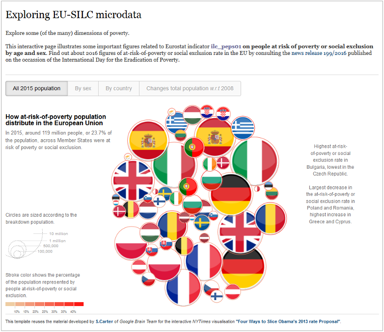
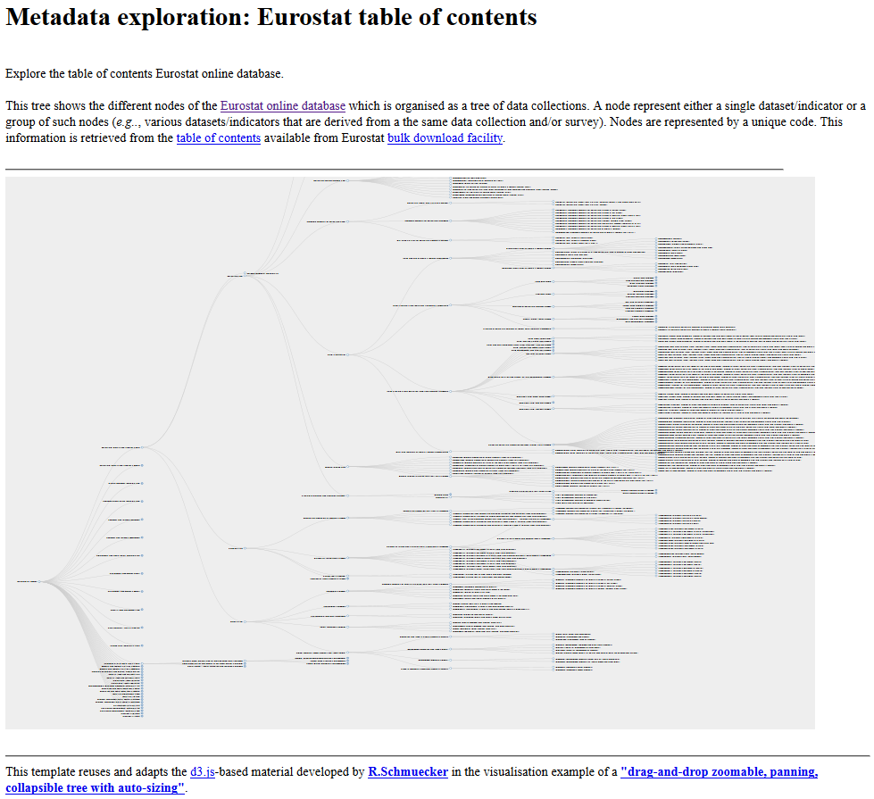

d3ex4es
=======

Applying `d3.js` framework for handling and exploring _Eurostat_ data and metadata.
---

**About**

This page provides few examples of web-based visualisation of the data and metadata disseminated on [ESTAT website](http://ec.europa.eu/eurostat/data/database). It uses for that purpose some already existing templates based on the `d3.js` library (_e.g._ see gallery referenced [below](#References)). Besides the example webpages, the material used to handle the extracted (meta)data and prepare (select/filter/reshape) them for visualisation is also provided.

<table align="center">
    <tr> <td align="left"><i>documentation</i></td> <td align="left">available at: https://eurostat.github.io/d3ex4es/</td> </tr> 
    <tr> <td align="left"><i>status</i></td> <td align="left">since 2017 &ndash; ongoing</td> </tr> 
    <tr> <td align="left"><i>contributors</i></td> 
    <td align="left" valign="middle">

</td> </tr> 
    <tr> <td align="left"><i>license</i></td> <td align="left"><a href="https://joinup.ec.europa.eu/sites/default/files/eupl1.1.-licence-en_0.pdfEUPL">EUPL</a> </td> </tr> 
</table>

**Description**

<table>
<header>
<td align="centre">Example 1</td>
<td align="centre">Example 2</td>
<td align="centre">Example 3</td>
</header>
<tr>
<td><kbd></kbd></td>
<td><kbd></kbd></td>
<td><kbd></kbd></td>
</tr>
</table>

* Example 1

The output visualisation provided in example 1 reuses the **material based on [`d3-force` layout](https://github.com/d3/d3-force)** developed for the _New York Times_ publication on [Obama's budget proposal](http://www.nytimes.com/interactive/2012/02/13/us/politics/2013-budget-proposal-graphic.html), so as to provide with an interactive display of selected _EU-SILC_ indicator.

The webpage [_example1_peps01.html_](https://github.com/eurostat/d3ex4es/blob/master/example1/example1_peps01.html) actually illustrates some important (2016) figures related to ESTAT indicator _ilc_peps01_ on *people at risk of poverty or social exclusion* by age and sex. 
Through `rawgit`, a **preview of this webpage is made available at this [address](https://cdn.rawgit.com/eurostat/d3ex4es/82aa792d/example1/example1_peps01.html)**  (though the display is much slower and some of the page features are disabled).

* Example 2

The output visualisation provided in example 2 reuses the **`d3` material introduced in a [tutorial](https://www.visualcinnamon.com/2015/08/stretched-chord.html) on flow diagrams**, so as to represent the dependency links between _Eurostat_ data and metadata.

The webpage [_example2_icw.html_](https://github.com/eurostat/d3ex4es/blob/master/example2/example2_icw.html) shows the dependency between Eurostat (experimental) indicators on income, consumption and wealth (ICW) and the various dimensions that are actually used for the definition of the population breakdowns. 
Through `rawgit`, a **preview of this webpage is made available at this [address](https://cdn.rawgit.com/eurostat/d3ex4es/82aa792d/example2/example2_icw_rawgit.html)** while another example based on the metadata for the **EU-SILC dataset is presented [here](https://cdn.rawgit.com/eurostat/d3ex4es/82aa792d/example2/example2_ilc_rawgit.html)**.

* Example 3

The graph visualisation presented in the example 3 reuses the **[`d3-tree` layout](https://github.com/mbostock/d3/wiki/Tree-Layout) material exposed in an online example of [drag-and-drop zoomable, panning, collapsible tree](https://www.visualcinnamon.com/2015/08/stretched-chord.html)**, so as to display the  table of contents of _Eurostat_ online database. 

The webpage [_example3_toc.html_](https://github.com/eurostat/d3ex4es/blob/master/example3/example3_toc.html) shows the expandable table of contents. Through `rawgit`, a **preview of this webpage is made available at this [address](https://cdn.rawgit.com/eurostat/d3ex4es/0b42fab3/example3/example3_toc_rawgit.html)**.

**References**

* `d3.js` [website](https://d3js.org/) and galleries: [wiki](https://github.com/d3/d3/wiki/Gallery), [_d3list_](http://christopheviau.com/d3list/gallery.html), and many more [examples](http://www.bogotobogo.com/DataVisualization/List_of_D3_Examples.php).
* Eurostat dissemination [website](http://ec.europa.eu/eurostat/data/database) and [blocks](https://bl.ocks.org).
* Eurostat bulk download [facility](http://ec.europa.eu/eurostat/estat-navtree-portlet-prod/BulkDownloadListing).

