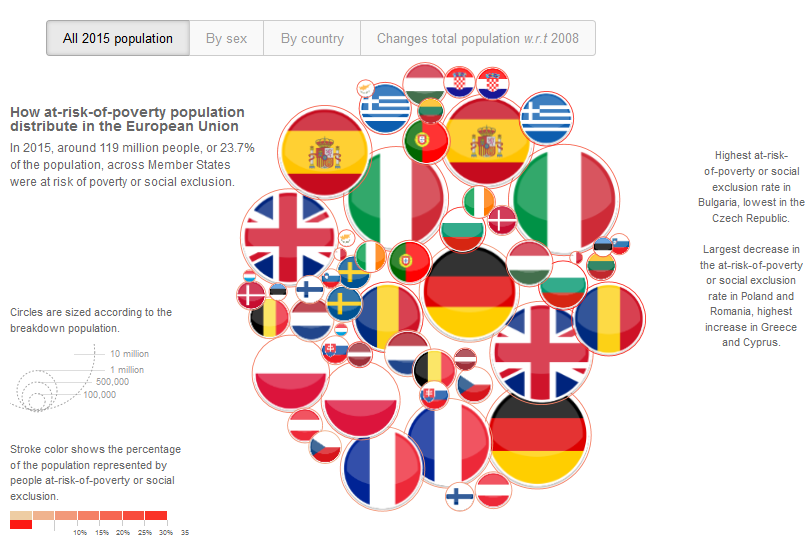
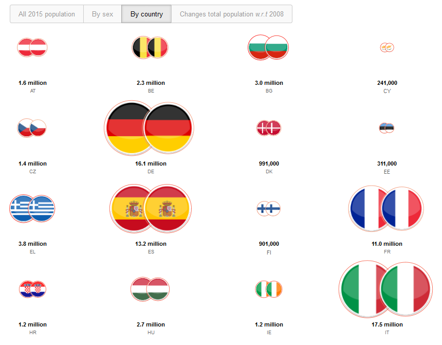

##### Example 1 - `d3-force` based visualisation of indicators

###### Description

This page provides relevant tools used to prepare selected social indicator data downloaded from [ESTAT website](http://ec.europa.eu/eurostat/data/database) and provide an interactive display based on [`d3-force` layout](https://github.com/d3/d3-force). These tools aim at reusing the material developed by S.Carter for the _New York Times_ publication mentioned [below](#References) so as to provide with a similar visualisation.

The webpage [_example1_peps01.html_](https://github.com/eurostat/d3ex4es/blob/master/example1/example1_peps01.html) illustrates some important figures related to ESTAT indicator _ilc_peps01_ on *people at risk of poverty or social exclusion* by age and sex (see also the  news release [below](#References)). The different pages are shown below:
<table>
<tr>
<td><kbd> </kbd></td>
<td><kbd> </kbd></td>
</tr>
<tr>
<td><kbd> </kbd></td>
<td><kbd> </kbd></td>
</tr>
</table>

**To actually see the interactive visualisation, you need to download the webpage and display it locally in your browser.** You can get a preview of this page using `rawgit`: **check this [address](https://cdn.rawgit.com/eurostat/d3ex4es/01d12b8f/example1/example1_peps01.html) for direct rendering**, though the display is much slower and some of its features are disabled.

###### Usage

All _html/javascript/css_ resources used by the original _"Four ways to slice..."_ publication have been embedded in the webpage _example1_peps01.html_. The code has been modified accordingly so as to visualise  specifically the selected data  (see `javascript` variables `estat.rate_data_total`, `estat.category_list` and `estat.category_data`).

We provide hereby two `Python` modules that will enable you to prepare the selected social indicators data for the visualisation:
* [`data.py`](https://github.com/eurostat/d3ex4es/blob/master/data.py) contains the classes/methods that will help you download the data from ESTAT website;
* [`display_force.py`](https://github.com/eurostat/d3ex4es/blob/master/display_force.py) contains the classes/methods that will enable you to format the data to be inserted in the webpage.

Note in particular that `display_force.py` implements some circle packing algorithms for optimally filling a circle with other circles: this is used to position the circle centers in the initial overall display. 

Data requested for the visualisation proposed in _example1_peps01.html_ webpage are formatted in the [`example1_peps01.py`](https://github.com/eurostat/d3ex4es/blob/master/example1_peps01.py) script. They are output as `JSON` but can be copied 'as is' in the webpage source code.

###### References

* S. Carter's `d3-force`-based display: ["Four ways to slice Obama's 2013 budget proposal"](http://www.nytimes.com/interactive/2012/02/13/us/politics/2013-budget-proposal-graphic.html), _New York Times_.
* `d3-force` layout [package](https://github.com/d3/d3-force).
* Eurostat press release 199/2016: ["The share of persons at risk of poverty or social exclusion in the EU back to its pre-crisis level"](http://ec.europa.eu/eurostat/documents/2995521/7695750/3-17102016-BP-EN.pdf).
* Eurostat _Statistical Explained_ [webpage](http://ec.europa.eu/eurostat/statistics-explained/index.php/People_at_risk_of_poverty_or_social_exclusion) on _People at risk of poverty or social exclusion_.
* Eurostat bubble chart: ["My country in a bubble"](http://ec.europa.eu/eurostat/cache/BubbleChart/).
* Algorithm for [circle packing](http://mathworld.wolfram.com/CirclePacking.html), _Wolfram_.
