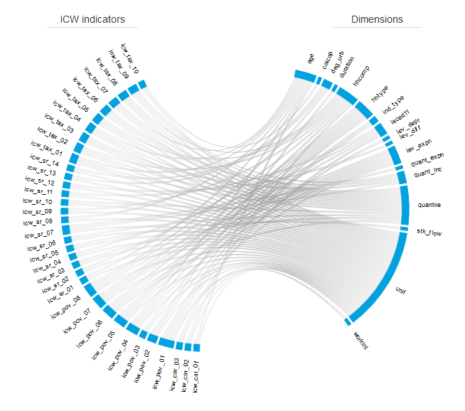

##### Example 2 - `d3`-based chord diagram visualisation of metadata

###### Description

The chord implementation presented here reuses the `d3` material introduced in an online tutorial on flow diagrams, and aims at representing the dependency links (relationship: _"which indicator utilise(s) this dimension? which dimension(s) are concerned by this indicator?_) between some _Eurostat_ indicators and the dimensions that are exploited for the definition of the population breakdowns. 

The webpage [_example2_icw.html_](https://github.com/eurostat/d3ex4es/blob/master/example2/example2_icw.html) shows the dependency between the various Eurostat (experimental) indicators on income, consumption and wealth (ICW) and the different concerned dimensions. See [below](#References) for further useful references.

<table>
<header>
<td align="centre"><i>ICW</i> indicators</td>
<td align="centre"><i>PEPS/PEES</i> indicators</td>
</header>
<tr>
<td><kbd> </kbd></td>
<td><kbd> </kbd></td>
</tr>
<header>
<td align="centre">(far too many) <i>ILC</i> indicators</td>
</header>
<tr>
<td><kbd> </kbd></td>
</tr>
</table>

You can get a preview of this page using `rawgit`: **check this [address](https://cdn.rawgit.com/eurostat/d3ex4es/82aa792d/example2/example2_icw_rawgit.html) for direct rendering**. Another **[example](https://cdn.rawgit.com/eurostat/d3ex4es/82aa792d/example2/example2_ilc_rawgit.html) displaying metadata for [EU-SILC indicators](http://ec.europa.eu/eurostat/web/income-and-living-conditions/data/database)** is also presented.

###### Usage

The original material includes: the _index.html_ webpage as well as the `Javascript` source codes [`d3.layout.chord.sort.js`](https://github.com/eurostat/d3ex4es/blob/master/example2/d3.layout.chord.sort.js) and
[`d3.layout.chord.sort.js`](https://github.com/eurostat/d3ex4es/blob/master/example2/d3.layout.chord.sort.js). The source [`script.js`](https://github.com/eurostat/d3ex4es/blob/master/example2/script.js) has been slightly adapted so as to make the dynamic data loading of _(dimension/indicator)_ data within the _index.html_ page possible. It has also been split in two so as to provide a separate configuration of the title of the graph in `title.js`.

The `Python` code [`example2_icw.py`](https://github.com/eurostat/d3ex4es/blob/master/example2/example2_icw.py) will enable you to reproduce the tables (files) used in the visualisation of the data/metadata relationship. It can be easily adapted to produce similar tables for other indicators.
We also provide two generic modules that will enable you to select and prepare the metadata like in the visualisation example:
* [`metadata.py`](https://github.com/eurostat/d3ex4es/blob/master/metadata.py) contains the classes/methods that help retrieve, from _Eurostat_ website, the metadata in bulk format; it also contains the method that will enable you to select the output indicators (see the role of the variable `INDICATOR_KEEP` in the code `example2_icw.py`) as well as the dimensions (_ibid_, see the use of the variable `DIMENSION_DROP`) to be presented;
* [`build_chord.py`](https://github.com/eurostat/d3ex4es/blob/master/build_chord.py) contains the method that formats and exports the input metadata table to be used in the visualisation.

The latter module will generate 3 `JSON` files (which are actually also `Javascript` scripts...), namely:
* [`INDICATOR.json`](https://github.com/eurostat/d3ex4es/blob/master/example2/INDICATOR.json) contains the list of indicators selected and whose metadata have been collected for,
* [`DIMENSION.json`](https://github.com/eurostat/d3ex4es/blob/master/example2/DIMENSION.json) contains the list of dimensions used by any of the indicators in the list above, 
* [`INDICATORxDIMENSION.json`](https://github.com/eurostat/d3ex4es/blob/master/example2/INDICATORxDIMENSION.json) contains the pseudo adjacency matrix used to represent the relationships between indicators and dimensions.

These files can then be dynamically loaded by the generic _index.html_ webpage. Note that any number of input indicator(s) present in the original _metabase.txt_ file can be selected, though it is recommended to keep this number small (see figure above with all EU-SILC indicators selected for representation).

For the visualisation of the metadata related to ICW indicators, the webpage [_example2_icw.html_](https://github.com/eurostat/d3ex4es/blob/master/example2/example2_icw.html) has been created as a specific copy of the generic _index.html_ webpage. To display the chord diagram locally in your browser, it will be necessary to download: 
* the source webpage _example2_icw.html, 
* the `Javascript` scripts `d3.layout.chord.sort.js`, `d3.layout.chord.sort.js`, `title.js` and `script.js`, 
* the generated `JSON` files.

###### References

*  N. Bremer's `d3`-based tutorial on ["How to create a flow diagram with a circular Twist"](https://www.visualcinnamon.com/2015/08/stretched-chord.html).
* [`d3-chord`](https://github.com/d3/d3-chord).
* _Eurostat_ [metabase file](http://ec.europa.eu/eurostat/estat-navtree-portlet-prod/BulkDownloadListing?sort=1&file=metabase.txt.gz) on bulk download facility.
* Eurostat _Experimental Statistics_ [webpage](http://ec.europa.eu/eurostat/web/experimental-statistics/income-consumption-and-wealth) on _Income, Consumption and Wealth_.
* [R source codes](https://github.com/eurostat/ICW) for _Experimental Statistics_ on (household) _Income, Consumption and Wealth_.
