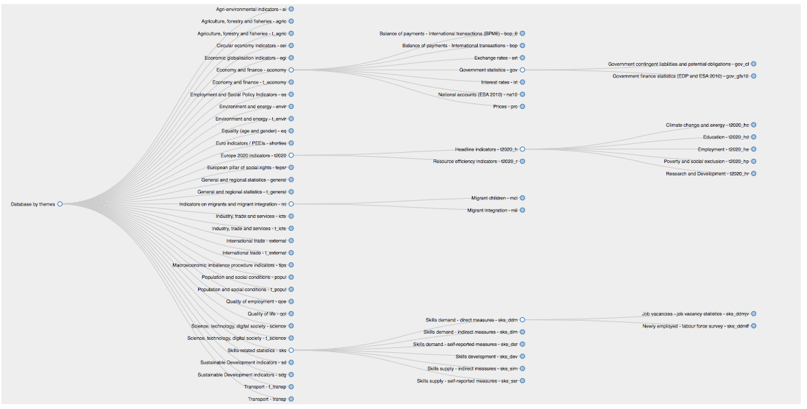

##### Example 3 - `d3-tree`-based visualisation of database contents as a collapsible tree

###### Description

The implementation presented here reuses the [`d3-tree`](https://github.com/mbostock/d3/wiki/Tree-Layout) material introduced in an example of graph visualisation as tree, and aims at representing the table of contents of Eurostat online database. 

The webpage [_example3_toc.html_](https://github.com/eurostat/d3.examples/blob/master/example3/example3_toc.html) represents the table of contents of _Eurostat_ online database as a collapsible tree implementing Reingold-Tilford algorithm. See [below](#References) for further useful references.

<table>
<tr>
<td><kbd> </kbd></td>
</tr>
</table>

You can get a preview of this page (_e.g._, using [`githack`](https://raw.githack.com/)): **check this [address](https://raw.githack.com/eurostat/d3.examples/master/example3/example3_toc_raw.html) for direct rendering**.

###### Usage

The original material includes: the `Javascript` source code [`dndTree.js`](https://github.com/eurostat/d3.examples/blob/master/example3/dndTree.js) that has been slightly adapted for the purpose of this visualisation.

The `Python` code [`example3_ToC.py`](https://github.com/eurostat/d3.examples/blob/master/example3/example3_ToC.py) will enable you to reproduce the tables (files) used in the visualisation of the table of contents. 
We also provide two generic modules that will enable you to select and prepare the metadata like in the visualisation example:
* [`metadata.py`](https://github.com/eurostat/d3.examples/blob/master/metadata.py) contains the classes/methods that help retrieve, from _Eurostat_ website, the metadata in bulk format;
* [`create_tree.py`](https://github.com/eurostat/d3.examples/blob/master/create_tree.py) contains the method that formats the table of contents and exports it so as to be used in the visualisation.

The latter module will generate a single `JSON` file (actually a `Javascript` script),  [`ToC.json`](https://github.com/eurostat/d3.examples/blob/master/example3/ToC.json) that contains the formatted table of contents.

###### References

* [What is a tree diagram?](http://www.d3noob.org/2014/01/tree-diagrams-in-d3js_11.html).
* M.Bostock's original [tidy](https://bl.ocks.org/mbostock/4339184) and [collapsible](https://bl.ocks.org/mbostock/4339083) trees.
*  R.Schmuecker `d3`-based example of ["drag-and-drop zoomable, panning, collapsible tree with auto-sizing"](http://www.robschmuecker.com/d3-js-drag-and-drop-zoomable-tree). Sources available [here](http://bl.ocks.org/robschmuecker/7880033).
* J.Zieve's [searchable collapsible tree](https://bl.ocks.org/jjzieve/a743242f46321491a950).
* `d3-tree` layout [package](https://github.com/mbostock/d3/wiki/Tree-Layout).
* [collapsibleTree](https://github.com/AdeelK93/collapsibleTree) implementation of collapsible tree in `R`.
* _Eurostat_ [table of contents](http://ec.europa.eu/eurostat/estat-navtree-portlet-prod/BulkDownloadListing?sort=1&file=table_of_contents_en.txt) on bulk download facility.
